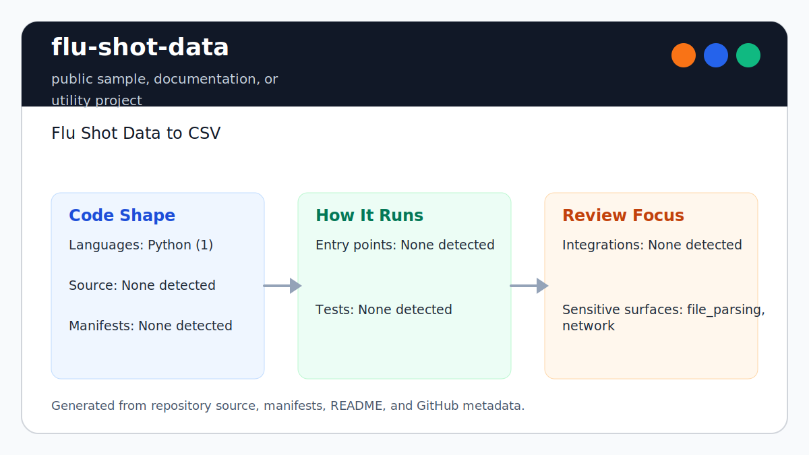

# flu-shot-data

<!-- README-OVERVIEW-IMAGE -->


## Overview

`garethpaul/flu-shot-data` is a public sample, documentation, or utility project. Flu Shot Data to CSV

This repository contains a small Python 3 scraper for the CDC weekly flu summary
page. It parses the national and regional summary table and writes `flu.csv`
and `flu.json`.

## Repository Contents

- `README.md` - project overview and local usage notes
- `CHANGES.md` - concise history of maintenance changes
- `Makefile` - local verification entry point
- `SECURITY.md` - security reporting and disclosure guidance
- `VISION.md` - project direction and maintenance guardrails
- `flushot.py` - Python 3 scraper, parser, and output writer
- `scripts/check-baseline.sh` - offline syntax, unit, and static baseline checks
- `tests/` - fixture-based tests for parser and output schema behavior

Additional scan context:

- Source directories: tests
- Dependency and build manifests: none detected
- Entry points or build surfaces: flushot.py
- Test-looking files: tests/test_flushot.py

## Getting Started

### Prerequisites

- Git
- Python 3.10 or newer

### Setup

```bash
git clone https://github.com/garethpaul/flu-shot-data.git
cd flu-shot-data
```

No third-party Python dependencies are required for the current baseline.

## Running or Using the Project

Generate `flu.csv` and `flu.json` from the CDC weekly flu summary page:

```bash
python3 flushot.py
```

Generated data files are ignored by default. Commit generated outputs only when
the data provenance and source date are reviewed.

## Testing and Verification

Run the offline baseline:

```bash
make check
```

The baseline compiles the Python files, runs fixture-based unit tests, and
checks that the scraper stays Python 3 compatible, uses HTTPS, and keeps
fetching, parsing, and writing separated. The parser tests also cover CDC
percent-positive cells that include a space before the percent sign and fail
when the expected flu summary headers are missing. They also cover unrelated
legacy `cellpadding=3` tables before the expected summary table, and summary
tables that omit the extra non-data subheading row before regional data.
Repeated header rows or blank-region rows inside the selected summary table are
skipped before records are written.

Fixture tests do not prove that the current live CDC page still has compatible
markup. Validate live scraping separately before publishing current data.

## Configuration and Secrets

- No required secret or credential file was identified in the repository scan. If you add integrations later, keep secrets out of git.

## Security and Privacy Notes

- Review changes touching network requests, sockets, or service endpoints; examples from the scan include flushot.py.
- Review changes touching file, media, JSON, XML, CSV, OCR, or data parsing; examples from the scan include flushot.py.

## Maintenance Notes

- Run `make check` before pushing parser, output schema, or documentation changes.
- See `SECURITY.md` for vulnerability reporting and safe research guidance.
- See `VISION.md` for project direction and contribution guardrails.
- See `docs/plans/2026-06-09-flu-shot-percent-normalization.md` for the
  percent field normalization contract.
- See `docs/plans/2026-06-09-flu-shot-summary-header-guard.md` for the CDC
  summary table header contract.
- See `docs/plans/2026-06-09-flu-shot-optional-subheading.md` for optional
  summary subheading handling.
- See `docs/plans/2026-06-09-flu-shot-table-selection.md` for selecting the
  expected summary table when unrelated matching tables are present.
- See `docs/plans/2026-06-09-flu-shot-summary-row-skip.md` for repeated header
  and blank-region row handling.

## Contributing

Keep changes small and tied to the project that is already present in this repository. For code changes, document the toolchain used, avoid committing generated dependency directories or local configuration, and update this README when setup or verification steps change.
